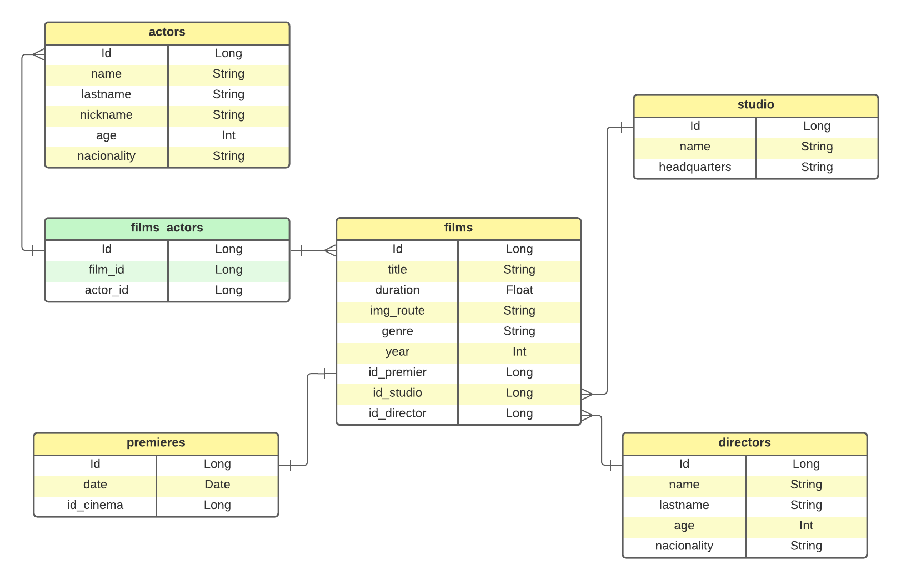
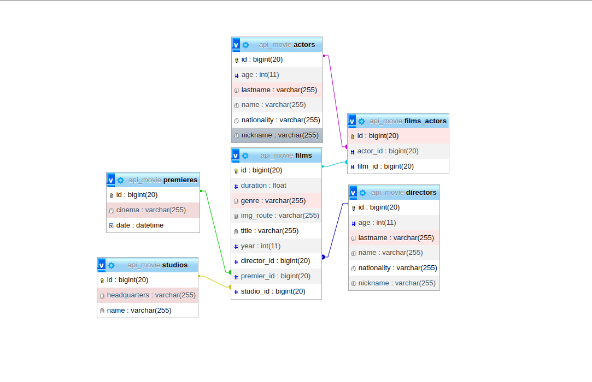

<!-- 
Este documento es de informativo, NO MODIFICAR
-->

# API-MOVIE
## Descripción
Este proyecto presentará información de películas, los actores, productores, directores y lugar de su primera función.

## Distribución de trabajo
El proyecto se dividirá por entidad, de la siguiente manera:

+ **Adolfo**: Films
+ **Leonardo**: Actors
+ **Yadira**: Premiers
+ **Isaí**: Studios
+ **Diego**: Producers

La configuracion por defecto está hecha para trabajar dentro de un entorno local, puedes modificar esto en **application.propierties**.

**IMPORTANTE**: Recuerda no compartir credenciales en git. Hemos modificado el archivo ./gitignore para omitir el archivo que configura el acceso a la base de datos remota, pero verifica tu stage antes de cualquier push con `git status`.

El desarrollo de este proyecto se dividirá por fases, y evolucionará según los temas que veamos en clases.

### Fase 1 - FINALIZADO
- Generar la estructura de las entidades y  DTOS.
- Crear los servicios necesarios y la interfaz.
- Implementar los servicios en los controladores para habilitar las peticiones, por defecto, cada entidad puede hacer sus peticiones en la ruta http://localhost:8080/tu-entidad.

### Fase 2 - FINALIZADO
- Relacionar las tablas.
- Crear las tablas pivote necesarias para las relaciones.
- Habilitar columna para almacenar las foreign keys de las tablas relacionadas.

### Fase 3 - [A discutir]
- Crear los servicios necesarios para poder almacenar las imágenes organizadas en carpetas de forma local.
- Retornar y almacenar en la base de datos la ruta local de las imágenes.

### Fase 3.1 - Actual
- Configurar los servicios y proyecciones de las uniones
- Habilitar los end-points para hacer las peticiones

### Fase 4 - FINALIZADO
- Migrar al entorno de los servicios de AWS.

---------------------

## Modelo Entidad-Relación
### Modelo previsto

### Modelo final 
Renderizado por PhpMyAdmin

